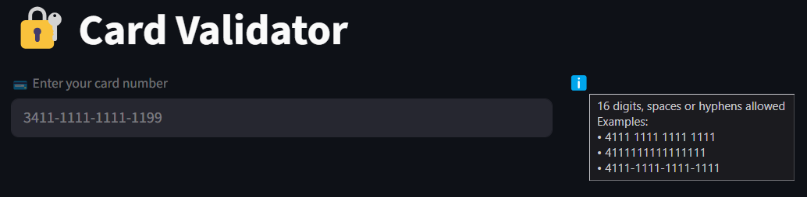
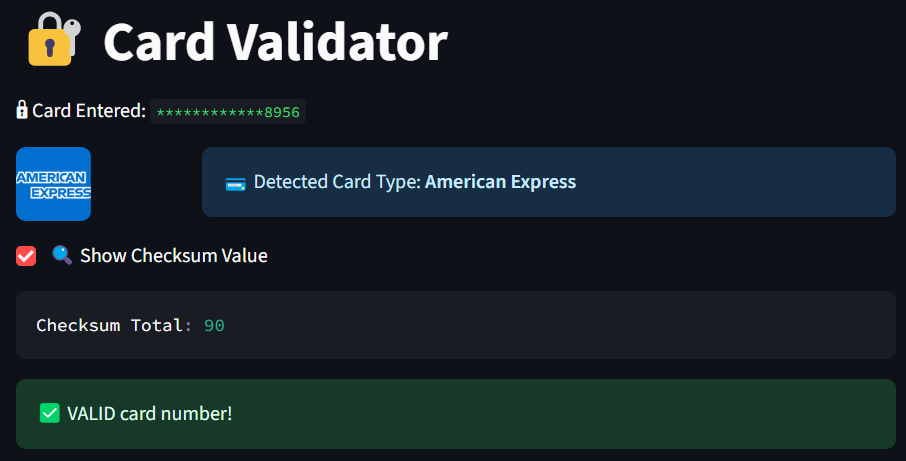
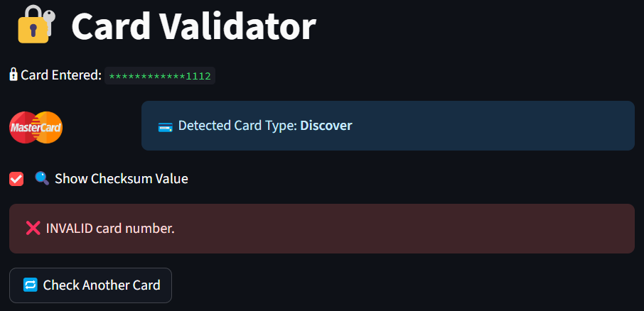

# 💳 Card Validator

[](https://github.com/AkshayCu-Codes/Mini-Python-Projects/tree/main/Card-Verifier)
[](https://www.linkedin.com/in/akshay-c-0a7106134/)
[](https://huggingface.co/spaces/Akshaycu/card-verifier)

An interactive Streamlit app that validates credit card numbers using the Luhn algorithm and identifies the card type (Visa, MasterCard, etc.) with masked input, hover tooltips, brand logos, and checksum visualization.

---

## 🚀 Live Demo

👉 **Access the app here**: [Card Verifier on Hugging Face](https://huggingface.co/spaces/Akshaycu/card-verifier)

---

## 🧠 How It Works

This app uses the **Luhn algorithm** (Mod 10 algorithm), a checksum formula used to validate a variety of identification numbers such as credit cards.

### ✅ Features
- 🔐 Real-time card validation (Luhn check)
- 🧠 Card type detection (Visa, MasterCard, etc.)
- 🖥️ Deployed via Hugging Face Spaces

---

## 🧪 Screenshots

### 🔘 Input With Tooltip


### ✅ Valid Card Detected


### ❌ Invalid Card Example


---

## 🛠️ Tech Stack
- **Python**
- **Streamlit**
- **Regex** (for formatting/validation)
- **Hugging Face Spaces** (deployment)

---

## 📦 Installation

```bash
git clone https://github.com/AkshayCu-Codes/Mini-Python-Projects.git
cd Mini-Python-Projects/Card-Verifier
pip install -r requirements.txt
streamlit run app.py
```

---

## 📄 Luhn Algorithm - Why It Matters

> The **Luhn algorithm** helps validate card number formats before actual processing, saving time and preventing errors.

**Steps:**
1. Double every second digit from the right.
2. If doubled digit ≥ 10, split and sum the digits.
3. Add all digits together.
4. If total % 10 == 0 → Valid!

---

## 🤝 Connect With Me

- [🔗 LinkedIn](https://www.linkedin.com/in/akshay-c-0a7106134/)
- [💻 GitHub](https://github.com/AkshayCu-Codes)

---

## 📂 Folder Structure

```
Card-Verifier/
│
├── app.py               # Streamlit app
├── main.py              # Optional entry point (if needed)
├── requirements.txt     # Dependencies
├── readme.md            # Local README
├── screenshots/
│   ├── card-input.png
│   ├── card-valid.png
│   └── card-invalid.png
```
