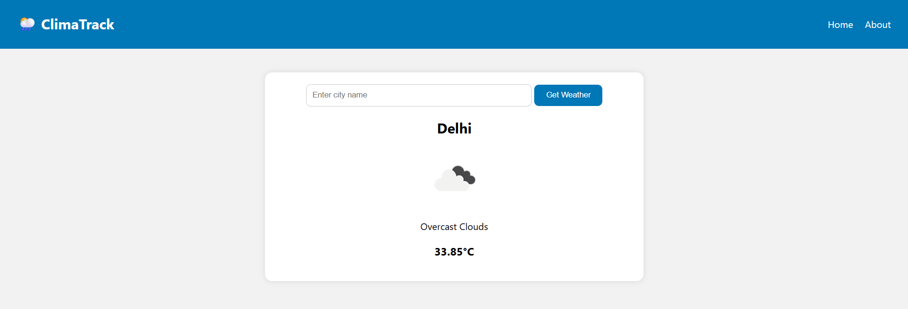
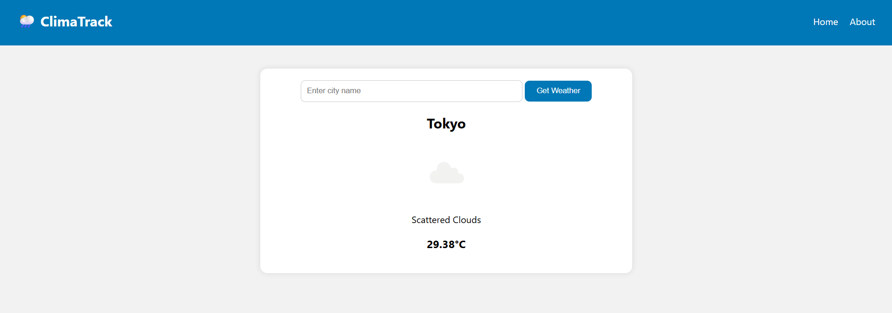
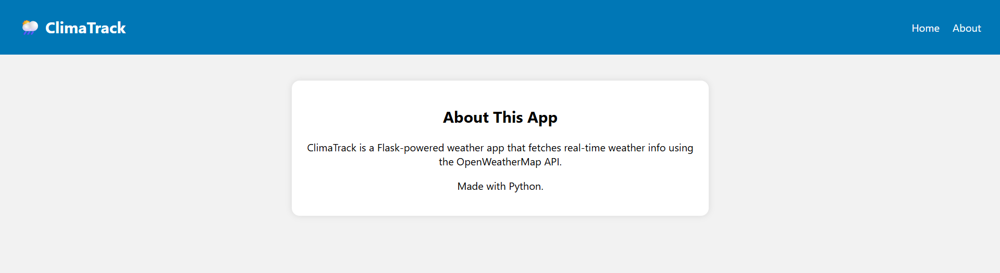

# 🌦️ ClimaTrack

**ClimaTrack** is a simple Flask-based web application that fetches and displays real-time weather information for any city using the [OpenWeatherMap API](https://openweathermap.org/api).

---

## 🚀 Features

- 🔍 Search weather by city name
- 🌡️ Displays temperature, humidity, and weather condition
- ⚡ Built with Flask (Python) and styled using CSS
- 🌐 Responsive UI with clean layout
- 📦 Secure API key handling via `.env` file

---

## 🛠️ Project Structure

```
flask_weather_app/
│
├── app.py                # Main Flask app
├── .env                  # API key stored securely
│
├── templates/
│   └── index.html        # HTML template
│
├── static/
│   └── styles.css        # Optional: CSS styling
```

---

## 🔧 Requirements

- Python 3.x
- Flask
- Requests
- python-dotenv

Install all dependencies:

```bash
pip install flask requests python-dotenv
```

---

## 🔑 Get an OpenWeatherMap API Key

1. Go to [https://openweathermap.org/api](https://openweathermap.org/api)
2. Sign up and get your **free API key**
3. Create a `.env` file in the project root and add:

```env
OPENWEATHER_API_KEY=your_api_key_here
```

---

## ▶️ How to Run

```bash
python app.py
```

Visit `http://127.0.0.1:5000` in your browser.

---

## 💡 Example Cities to Try

- Delhi
- London
- New York
- Tokyo
- Bengaluru

---

## 📸 Preview






---

## 📌 Future Improvements

- 🌍 **Geolocation Weather**  
  Auto-detect user's location to show weather without manual input.

- 🎨 **Theming and UI Enhancements**  
  Add light/dark theme toggle and use weather-based background animations (e.g., rainy, sunny).

- 📊 **Hourly & Weekly Forecasts**  
  Extend functionality to display hourly and 7-day weather forecasts.

- 🔔 **Weather Alerts**  
  Integrate weather warnings and alerts from APIs for severe conditions.

- 📱 **Progressive Web App (PWA)**  
  Make ClimaTrack installable on mobile devices with offline support.

- 💬 **Voice Search**  
  Enable users to search for cities using voice commands.

- 📌 **Recent & Saved Cities**  
  Show history of searched cities and allow users to pin/save favorites.

- 📦 **Switch to a More Detailed API**  
  Optionally migrate to a richer API like Weatherstack or AccuWeather for additional data (e.g., humidity, wind, AQI).

- 🌐 **Multi-language Support**  
  Add support for different languages and units (°C/°F, km/h vs mph).

- 📈 **Data Visualizations**  
  Show charts for temperature trends using libraries like Chart.js or D3.js.


---

## 📄 License

This project is licensed under the MIT License.